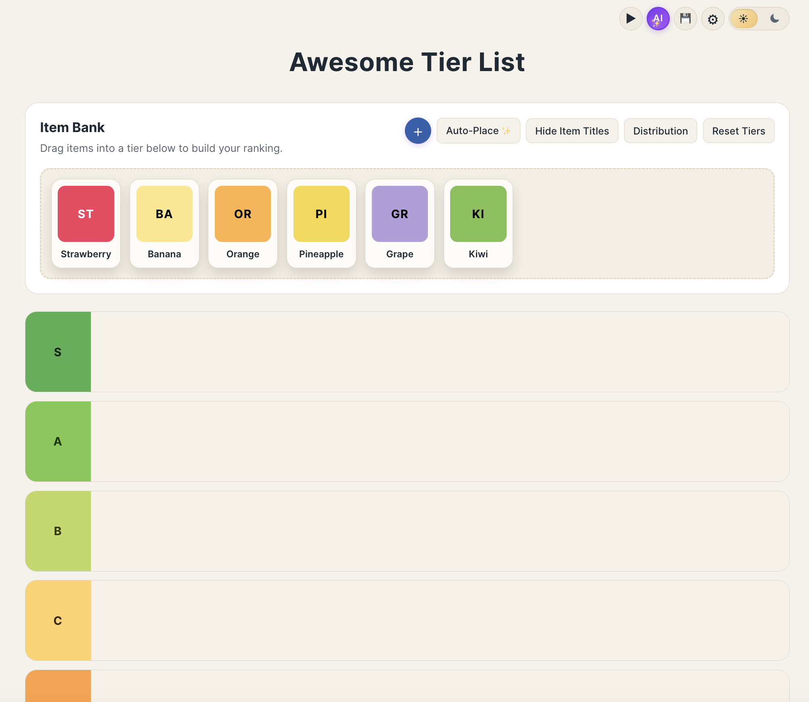
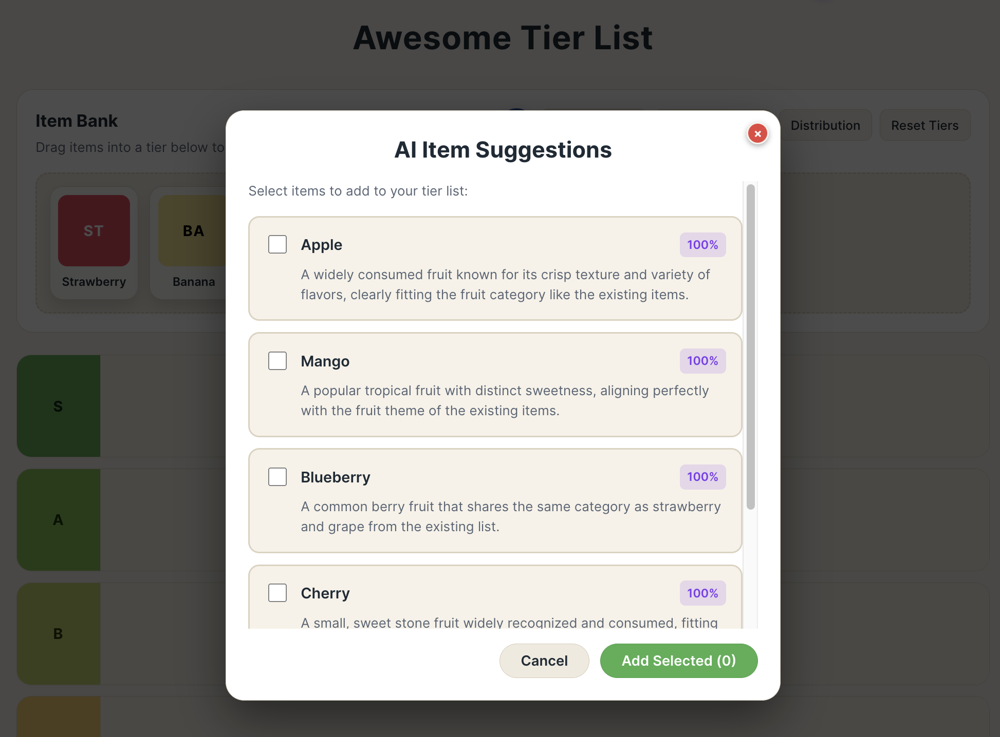
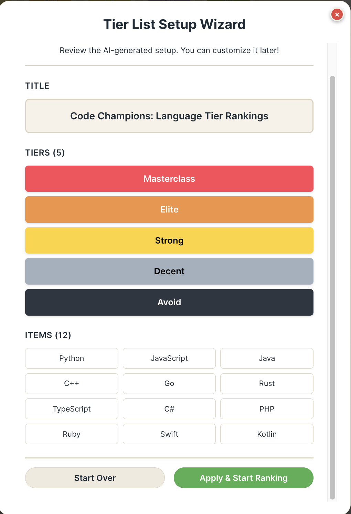
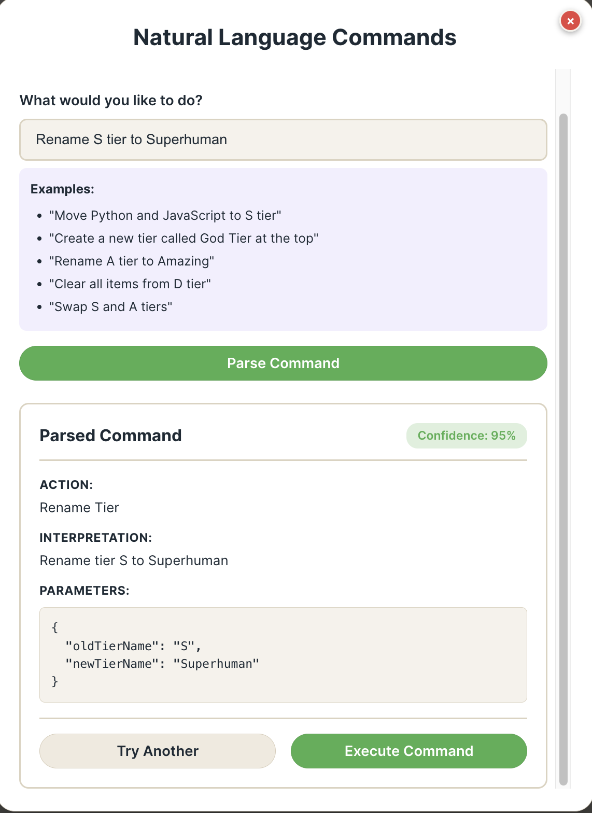
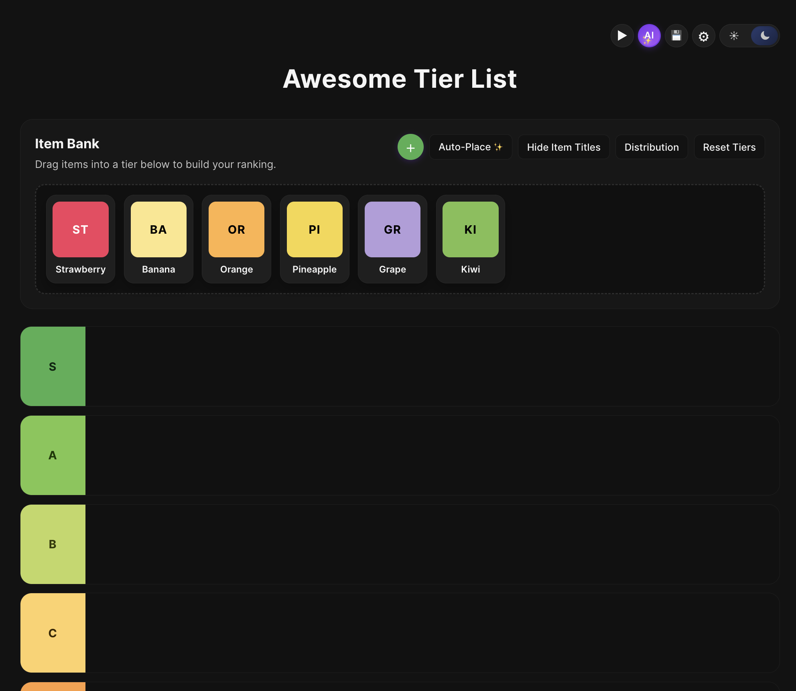
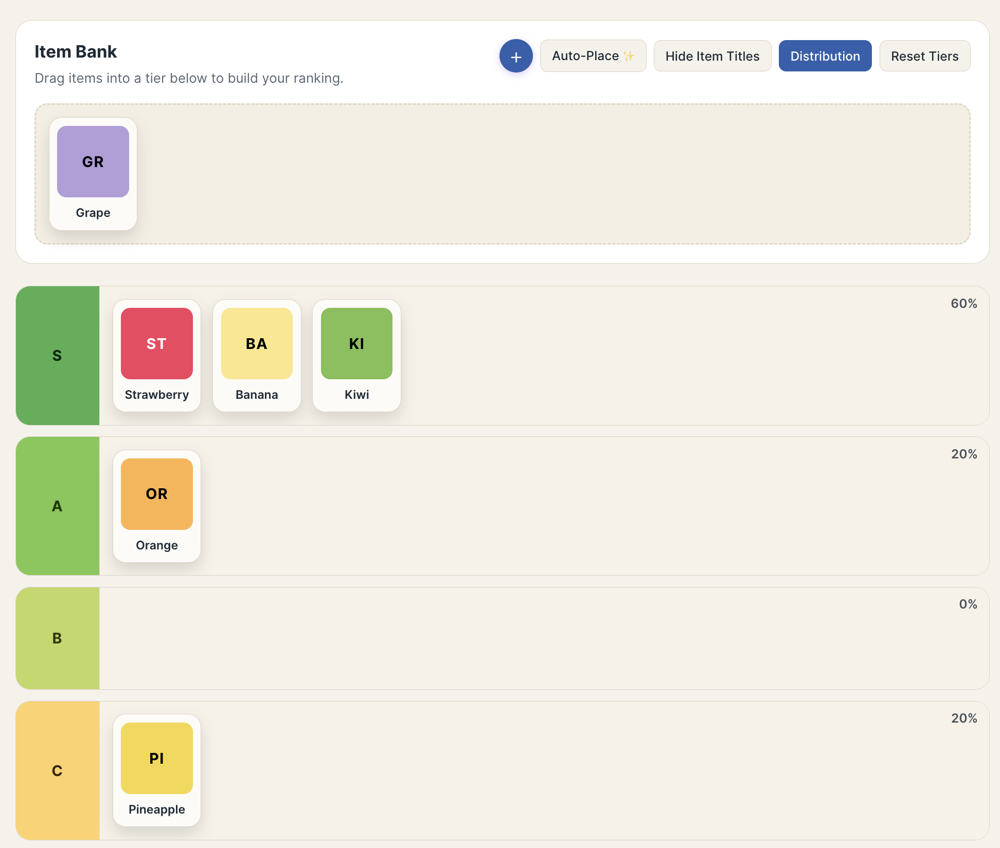

<!-- Improved compatibility of back to top link: See: https://github.com/othneildrew/Best-README-Template/pull/73 -->
<a id="readme-top"></a>

<!-- PROJECT SHIELDS -->
[](https://awesome.re)
[![Contributors][contributors-shield]][contributors-url]
[![Forks][forks-shield]][forks-url]
[![Stargazers][stars-shield]][stars-url]
[![Issues][issues-shield]][issues-url]
[![MIT License][license-shield]][license-url]

<!-- PROJECT LOGO -->
<br />
<div align="center">
  <a href="https://github.com/aimhco/awesome-ai-tier-list-maker">
    
  </a>

  <h3 align="center">Awesome AI Tier List Maker</h3>

  <p align="center">
    A modern, feature-rich tier list maker with AI-powered suggestions, natural language commands, and OCR image text extraction.
    <br />
    <a href="#features"><strong>Explore the features »</strong></a>
    <br />
    <br />
    <a href="https://tierlist.aimh.co">View Demo</a>
    ·
    <a href="https://github.com/aimhco/awesome-ai-tier-list-maker/issues/new?labels=bug&template=bug-report---.md">Report Bug</a>
    ·
    <a href="https://github.com/aimhco/awesome-ai-tier-list-maker/issues/new?labels=enhancement&template=feature-request---.md">Request Feature</a>
  </p>
</div>

<!-- BADGES -->
<div align="center">

[![React][React-badge]][React-url]
[![TypeScript][TypeScript-badge]][TypeScript-url]
[![Vite][Vite-badge]][Vite-url]
[![Node.js][Node-badge]][Node-url]

</div>

<!-- TABLE OF CONTENTS -->
<details>
  <summary>Table of Contents</summary>
  <ol>
    <li>
      <a href="#about-the-project">About The Project</a>
      <ul>
        <li><a href="#built-with">Built With</a></li>
      </ul>
    </li>
    <li>
      <a href="#features">Features</a>
      <ul>
        <li><a href="#core-features">Core Features</a></li>
        <li><a href="#ai-powered-features">AI-Powered Features</a></li>
        <li><a href="#customization">Customization</a></li>
        <li><a href="#save--export">Save & Export</a></li>
      </ul>
    </li>
    <li>
      <a href="#screenshots">Screenshots</a>
    </li>
    <li>
      <a href="#getting-started">Getting Started</a>
      <ul>
        <li><a href="#prerequisites">Prerequisites</a></li>
        <li><a href="#installation">Installation</a></li>
        <li><a href="#environment-variables">Environment Variables</a></li>
      </ul>
    </li>
    <li>
      <a href="#usage">Usage</a>
      <ul>
        <li><a href="#creating-a-tier-list">Creating a Tier List</a></li>
        <li><a href="#using-ai-features">Using AI Features</a></li>
        <li><a href="#natural-language-commands">Natural Language Commands</a></li>
      </ul>
    </li>
    <li>
      <a href="#ai-models">AI Models</a>
      <ul>
        <li><a href="#default-free-models">Default Free Models</a></li>
        <li><a href="#using-paid-models">Using Paid Models</a></li>
        <li><a href="#vision-models-for-ocr">Vision Models for OCR</a></li>
      </ul>
    </li>
    <li><a href="#deployment">Deployment</a></li>
    <li><a href="#contributing">Contributing</a></li>
    <li><a href="#license">License</a></li>
    <li><a href="#contact">Contact</a></li>
    <li><a href="#acknowledgments">Acknowledgments</a></li>
  </ol>
</details>

---

<!-- ABOUT THE PROJECT -->
## About The Project

<div align="center">
  
</div>

The **Awesome AI Tier List Maker** is a modern web application that allows you to create, customize, and share tier lists with ease. Unlike traditional tier list makers, this application leverages AI to help you:

- **Generate item suggestions** based on any topic
- **Get intelligent tier placement recommendations**
- **Extract text from images** using OCR
- **Control the app with natural language commands**
- **Set up entire tier lists** with AI-assisted wizards

Whether you're ranking your favorite movies, video game characters, or anything else, this tool makes the process faster and more intuitive.

<p align="right">(<a href="#readme-top">back to top</a>)</p>

### Built With

This project is built with modern web technologies:

| Technology | Purpose |
|------------|---------|
| [![React][React-badge]][React-url] | UI Framework |
| [![TypeScript][TypeScript-badge]][TypeScript-url] | Type Safety |
| [![Vite][Vite-badge]][Vite-url] | Build Tool |
| [dnd-kit](https://dndkit.com/) | Drag and Drop |
| [OpenRouter](https://openrouter.ai/) | AI API Gateway |
| [html-to-image](https://github.com/bubkoo/html-to-image) | Export to PNG |

<p align="right">(<a href="#readme-top">back to top</a>)</p>

---

<!-- FEATURES -->
## Features

### Core Features

| Feature | Description |
|---------|-------------|
| **Drag & Drop** | Intuitive drag and drop interface to move items between tiers |
| **Custom Items** | Add text items or upload images to your tier list |
| **Inline Editing** | Double-click any item to edit its label directly |
| **Image Upload** | Upload multiple images at once (up to 20) |
| **OCR Text Extraction** | Automatically extract text from uploaded images using AI |
| **Distribution View** | See percentage distribution of items across tiers |

### AI-Powered Features

All AI features are powered by free models through [OpenRouter](https://openrouter.ai/), making them completely free to use.

| Feature | Description |
|---------|-------------|
| **✨ Smart Suggestions** | Generate item suggestions based on your tier list topic |
| **✨ AI Tier Placement** | Get AI recommendations for where to place items |
| **✨ Description Generator** | Generate descriptions explaining your tier list |
| **✨ Setup Wizard** | Create entire tier lists from scratch with AI assistance |
| **✨ Natural Commands** | Control the app using natural language (e.g., "move Mario to S tier") |
| **✨ OCR Extraction** | Extract text from images to create items automatically |

### Customization

| Feature | Description |
|---------|-------------|
| **Custom Tiers** | Add, remove, rename, and reorder tiers |
| **Tier Colors** | Choose custom colors for each tier |
| **Dark/Light Mode** | Toggle between dark and light themes |
| **Title Editing** | Customize your tier list title |

### Save & Export

| Feature | Description |
|---------|-------------|
| **Save to Browser** | Save tier lists to local storage |
| **Load Saved Lists** | Load previously saved tier lists |
| **Export as PNG** | Export your tier list as a high-quality image |
| **Reset Tiers** | Reset to default S/A/B/C/D configuration |

<p align="right">(<a href="#readme-top">back to top</a>)</p>

---

<!-- SCREENSHOTS -->
## Screenshots

<details>
<summary>Click to view screenshots</summary>

### Main Interface
<div align="center">
  
  <p><em>The main tier list interface with drag and drop functionality</em></p>
</div>

### AI Smart Suggestions
<div align="center">
  
  <p><em>AI-generated item suggestions based on your topic</em></p>
</div>

### AI Setup Wizard
<div align="center">
  
  <p><em>Create entire tier lists with AI assistance</em></p>
</div>

### Natural Language Commands
<div align="center">
  
  <p><em>Control the app with natural language</em></p>
</div>

### Image Upload with OCR
<div align="center">
  
  <p><em>Extract text from uploaded images automatically</em></p>
</div>

### Dark Mode
<div align="center">
  
  <p><em>Full dark mode support</em></p>
</div>

### Distribution View
<div align="center">
  
  <p><em>See percentage distribution of items across tiers</em></p>
</div>

</details>

<p align="right">(<a href="#readme-top">back to top</a>)</p>

---

<!-- GETTING STARTED -->
## Getting Started

Follow these steps to set up the project locally.

### Prerequisites

- **Node.js** (v18 or higher)
- **npm** or **yarn**
- **OpenRouter API Key** (free) - [Get one here](https://openrouter.ai/keys)

### Installation

1. **Clone the repository**
   ```bash
   git clone https://github.com/aimhco/awesome-ai-tier-list-maker.git
   cd awesome-ai-tier-list-maker/app
   ```

2. **Install dependencies**
   ```bash
   npm install
   ```

3. **Set up environment variables**
   ```bash
   cp .env.example .env.local
   ```

4. **Add your OpenRouter API key**
   
   Edit `.env.local` and add your API key:
   ```bash
   VITE_OPENROUTER_API_KEY=your_openrouter_api_key_here
   ```

5. **Start the development server**
   ```bash
   npm run dev
   ```

6. **Open in browser**
   
   Navigate to `http://localhost:5173`

### Environment Variables

| Variable | Description | Default |
|----------|-------------|---------|
| `VITE_OPENROUTER_API_KEY` | Your OpenRouter API key (required) | - |
| `VITE_AI_MODE` | `user` for local dev, `public` for production | `user` |
| `VITE_AI_MODEL` | Comma-separated list of models | Free models |

<p align="right">(<a href="#readme-top">back to top</a>)</p>

---

<!-- USAGE -->
## Usage

### Creating a Tier List

1. **Set a title** - Click the title at the top to edit it
2. **Add items** - Use the "Add Item" button or upload images
3. **Drag and drop** - Move items between tiers
4. **Customize tiers** - Click the tier label to edit, or use the settings menu

### Using AI Features

Click the **AI button** (sparkle icon) in the toolbar to access:

| Feature | How to Use |
|---------|------------|
| **Smart Suggestions** | Enter a topic and get AI-generated item suggestions |
| **Tier Placement** | Select items and get AI recommendations for placement |
| **Description Generator** | Generate a description explaining your rankings |
| **Setup Wizard** | Enter a topic and let AI create the entire tier list |
| **Natural Commands** | Type commands in plain English |

### Natural Language Commands

The Natural Commands feature understands commands like:

| Command | Action |
|---------|--------|
| "Move Mario to S tier" | Moves an item to a specific tier |
| "Create a new tier called Legendary" | Creates a new tier |
| "Rename tier B to Good" | Renames an existing tier |
| "Clear all items from D tier" | Removes all items from a tier |
| "Delete the F tier" | Removes a tier |
| "Swap S and A tiers" | Swaps the positions of two tiers |

> **Note:** Natural Commands works best with one command at a time.

<p align="right">(<a href="#readme-top">back to top</a>)</p>

---

<!-- AI MODELS -->
## AI Models

This application uses [OpenRouter](https://openrouter.ai/) as an AI gateway, which provides access to multiple AI models from different providers.

### Default Free Models

The app uses **100% free models** by default:

| Model | Provider | Purpose |
|-------|----------|---------|
| `amazon/nova-2-lite-v1:free` | Amazon | Primary model |
| `google/gemini-2.0-flash-exp:free` | Google | Fallback model |
| `meta-llama/llama-3.3-70b-instruct:free` | Meta | Fallback model |

The app automatically falls back to the next model if one is unavailable.

### Vision Models for OCR

For image text extraction (OCR), the app uses vision-capable models:

| Model | Provider |
|-------|----------|
| `google/gemini-2.0-flash-exp:free` | Google |
| `amazon/nova-2-lite-v1:free` | Amazon |

### Using Paid Models

For local development, you can use any model available on OpenRouter, including paid models:

1. **Edit your `.env.local` file:**
   ```bash
   VITE_AI_MODE=user
   VITE_AI_MODEL=openai/gpt-4o,anthropic/claude-3.5-sonnet
   ```

2. **Popular paid models:**
   
   | Model | Provider | Best For |
   |-------|----------|----------|
   | `openai/gpt-4o` | OpenAI | Best overall quality |
   | `anthropic/claude-3.5-sonnet` | Anthropic | Complex reasoning |
   | `openai/gpt-4o-mini` | OpenAI | Good balance of cost/quality |
   | `google/gemini-2.0-flash` | Google | Fast responses |

3. **Check pricing:** [OpenRouter Models](https://openrouter.ai/models)

> **Important:** When `VITE_AI_MODE=public` (production), only free models are allowed to prevent unexpected costs.

<p align="right">(<a href="#readme-top">back to top</a>)</p>

---

<!-- DEPLOYMENT -->
## Deployment

### Build for Production

```bash
npm run build
```

The built files will be in the `dist` directory, ready for deployment to any static hosting service.

### Deploy to Vercel

[](https://vercel.com/new/clone?repository-url=https://github.com/aimhco/awesome-ai-tier-list-maker)

1. **Connect your GitHub repository** to Vercel
2. **Set environment variables** in Vercel dashboard:
   - `VITE_OPENROUTER_API_KEY` = your API key
   - `VITE_AI_MODE` = `public`
3. **Deploy** - Vercel will automatically build and deploy

<p align="right">(<a href="#readme-top">back to top</a>)</p>

---

<!-- CONTRIBUTING -->
## Contributing

Contributions are what make the open source community such an amazing place to learn, inspire, and create. Any contributions you make are **greatly appreciated**.

If you have a suggestion that would make this better, please fork the repo and create a pull request. You can also simply open an issue with the tag "enhancement".

Don't forget to give the project a star! Thanks again!

1. Fork the Project
2. Create your Feature Branch (`git checkout -b feature/AmazingFeature`)
3. Commit your Changes (`git commit -m 'Add some AmazingFeature'`)
4. Push to the Branch (`git push origin feature/AmazingFeature`)
5. Open a Pull Request

### Top Contributors

<a href="https://github.com/aimhco/awesome-ai-tier-list-maker/graphs/contributors">
  
</a>

<p align="right">(<a href="#readme-top">back to top</a>)</p>

---

<!-- LICENSE -->
## License

Distributed under the MIT License. See `LICENSE` for more information.

<p align="right">(<a href="#readme-top">back to top</a>)</p>

---

<!-- CONTACT -->
## Contact

Denny - denny@aimh.co

Project Link: [https://github.com/aimhco/awesome-ai-tier-list-maker](https://github.com/aimhco/awesome-ai-tier-list-maker)

<p align="right">(<a href="#readme-top">back to top</a>)</p>

---

<!-- ACKNOWLEDGMENTS -->
## Acknowledgments

Resources and tools that made this project possible:

* [OpenRouter](https://openrouter.ai/) - AI API Gateway
* [React](https://reactjs.org/) - UI Framework
* [Vite](https://vitejs.dev/) - Build Tool
* [dnd-kit](https://dndkit.com/) - Drag and Drop
* [html-to-image](https://github.com/bubkoo/html-to-image) - Image Export
* [Shields.io](https://shields.io/) - README Badges
* [Best-README-Template](https://github.com/othneildrew/Best-README-Template) - README Template

<p align="right">(<a href="#readme-top">back to top</a>)</p>

---

<!-- MARKDOWN LINKS & IMAGES -->
<!-- https://www.markdownguide.org/basic-syntax/#reference-style-links -->
[contributors-shield]: https://img.shields.io/github/contributors/aimhco/awesome-ai-tier-list-maker.svg?style=for-the-badge
[contributors-url]: https://github.com/aimhco/awesome-ai-tier-list-maker/graphs/contributors
[forks-shield]: https://img.shields.io/github/forks/aimhco/awesome-ai-tier-list-maker.svg?style=for-the-badge
[forks-url]: https://github.com/aimhco/awesome-ai-tier-list-maker/network/members
[stars-shield]: https://img.shields.io/github/stars/aimhco/awesome-ai-tier-list-maker.svg?style=for-the-badge
[stars-url]: https://github.com/aimhco/awesome-ai-tier-list-maker/stargazers
[issues-shield]: https://img.shields.io/github/issues/aimhco/awesome-ai-tier-list-maker.svg?style=for-the-badge
[issues-url]: https://github.com/aimhco/awesome-ai-tier-list-maker/issues
[license-shield]: https://img.shields.io/github/license/aimhco/awesome-ai-tier-list-maker.svg?style=for-the-badge
[license-url]: https://github.com/aimhco/awesome-ai-tier-list-maker/blob/master/LICENSE

<!-- TECHNOLOGY BADGES -->
[React-badge]: https://img.shields.io/badge/React-20232A?style=for-the-badge&logo=react&logoColor=61DAFB
[React-url]: https://reactjs.org/
[TypeScript-badge]: https://img.shields.io/badge/TypeScript-007ACC?style=for-the-badge&logo=typescript&logoColor=white
[TypeScript-url]: https://www.typescriptlang.org/
[Vite-badge]: https://img.shields.io/badge/Vite-646CFF?style=for-the-badge&logo=vite&logoColor=white
[Vite-url]: https://vitejs.dev/
[Node-badge]: https://img.shields.io/badge/Node.js-43853D?style=for-the-badge&logo=node.js&logoColor=white
[Node-url]: https://nodejs.org/
